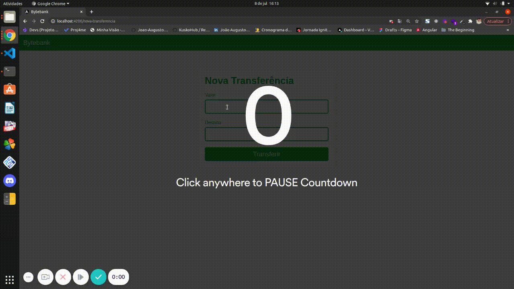

<div align="center">

<h3>

Projeto realizado no Curso de Fundamentos de Angular promovido pela [Alura], utilizando **HTML**, **CSS**, **Typescript** e **Angular**.

</h3>

  

</div>

<br>

## 📚 **Sobre**

Aplicação consiste num modelo de extrato bancário, permitindo adicionar transferência, informando o valor e o destino, além de capturar a data corrente.
Também é possível excluir as transferências realizadas.

Principais tópicos sobre Angular debatidos:
- Comunicação entre componentes com @Output e @Input;
- Implementação de service;
- Requisições à api fake utilizando HttpClient;
- Configuração de rotas com RouterModule;
- Utilização de RouterLink;

<br>

### 📌  **Tecnologias utilizadas**
- Angular
- TypeScript
- Json-server

<br>
<br>

### 🚀 **Mão na massa**

```bash
# Clone este repositório
$ git clone https://github.com/Joao-Augusto-Oliveira/bytebank

# Acesse a pasta do projeto no terminal/cmd
$ cd bytebank

# Instale as dependências
$ npm install

# Execute a FAKE Api com JSON Server
$ json-server --watch db.json

# Execute a aplicação em modo de desenvolvimento
$ ng s -o


```

<br>
<br>

<h3 align="center">
Feito com 💜 por <a href="https://www.linkedin.com/in/joão-augusto-oliveira-dos-santos-9b0693195">João Augusto</a>
<br><br> 
</h3>

<!-- Links -->

[Alura]: https://www.alura.com.br//


